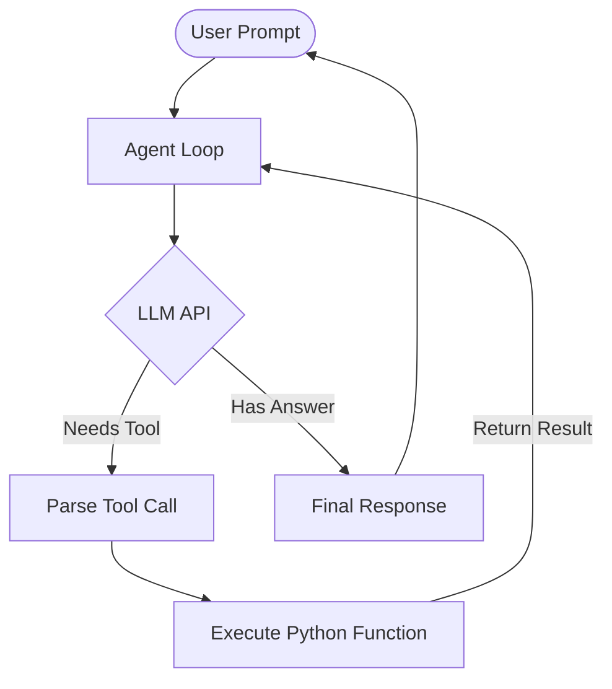

# How I Built My First AI Agent Using Cursor (Step-by-Step)

I kept hearing that AI agents were the future. My Twitter feed was flooded with claims about autonomous software that could research, code, and deploy entire applications while I slept. But every AI agent tutorial I found either skipped the hard implementation details or assumed I already had a PhD in machine learning. 

I didn't want to rely on massive, abstracted frameworks right out of the gate. I wanted to understand the primitive building blocks. Instead of watching another theoretical video, I opened my laptop, fired up my editor, and decided to figure out how to build AI agent with Cursor from scratch. 

If you've been wondering what it actually takes to move from simple API calls to autonomous agents, you're in the right place. In this guide, I'm going to walk you through exactly how I built my first AI agent using Cursor. I'll share the actual workflow, the architecture decisions, the nasty debugging sessions, and the hard-learned lessons you only get from actually writing the code. 

You'll see exactly how Cursor AI helped me write the boilerplate, navigate complex LLM logic, and debug context loops. By the end of this, you won't just understand AI agent development—you'll be ready to build your own.

---

## What Is an AI Agent?

Before writing a single line of code, we need to separate the hype from reality. 

For a long time, I thought an "agent" was just a fancy word for a chatbot with a system prompt. It isn't. The fundamental difference between an AI chatbot and an AI agent comes down to **agency**. A chatbot predicts the next word based on your input. An agent makes decisions, interacts with the outside world, and iterates until it solves a problem.

Here are the core components that make an agent different from a standard LLM script:

- **Planning:** The ability to take a complex user request and break it down into a logical sequence of steps.
- **Tool Calling (or Function Calling):** The ability to execute external code. This is what lets an agent search the web, read a file, or query a database instead of just returning text.
- **Memory:** Keeping track of what has been done, what failed, and what needs to happen next. This prevents the agent from running in endless circles.
- **Decision Making (Reasoning):** Evaluating the output of a tool and deciding on the next best action.

If an LLM can trigger a Python function, evaluate the result, and decide what to do next without my intervention, it's an agent.

> 💡 **Tip:**
> Start with a single tool before trying multi-agent systems. Adding five tools on day one is the easiest way to overwhelm both the LLM and yourself. Master the single-tool loop first.

---

## Why I Chose Cursor

When starting this project, I needed an environment that understood modern AI workflows. Building an LLM agent requires writing a lot of glue code—handling API responses, parsing JSON, managing conversation history arrays, and dealing with asynchronous tool execution.

I chose the Cursor IDE for a few specific reasons:

1. **AI Pair Programming:** Writing the boilerplate for LLM API wrappers is tedious. Cursor's inline generation allowed me to scaffold the basic OpenAI integration in seconds.
2. **Contextual Awareness:** As my agent grew to include separate files for tools, memory management, and the main reasoning loop, Cursor's ability to read my entire codebase meant I could ask questions like, "Why is my tool registry not passing arguments to the execution function?" and it would pinpoint the bug across files.
3. **Agent Mode (Composer):** Cursor has its own agentic capabilities built in. Using an AI coding assistant to build an AI agent felt a bit meta, but it accelerated my prototyping massively. 
4. **Fast Debugging:** When an LLM returns a malformed JSON string instead of a valid tool call, debugging can be a nightmare. Highlighting the error in Cursor and hitting `Cmd+K` gave me instant fixes.

Cursor isn't a magic wand. It will occasionally hallucinate a variable that doesn't exist or suggest a deprecated API method. But for AI engineering, the speed at which it lets you iterate is unmatched.

---

## Project Goal

I wanted to build something practical but scoped tightly enough that I wouldn't abandon it after a weekend. 

**The Goal:** A simple CLI-based research assistant. 

This agent needed to:
- Accept a research task from me.
- Reason about how to solve it.
- Use a tool to fetch real-world data (a mock weather API and a mock Wikipedia search).
- Remember what it just searched for.
- Synthesize a final, useful response.

I avoided building a UI. The terminal is the best place to debug an LLM agent because you can stream the raw API responses and see exactly how the model is "thinking."

---

## Step 1 – Planning

If you skip the planning phase in AI agent development, you will end up with an unmaintainable mess of chained API calls. 

I sat down with a notepad and mapped out my architecture.

### 1. Define the Problem
The user asks a question that requires external data. The LLM cannot answer it from its weights alone.

### 2. Define Inputs and Outputs
- **Input:** A plain text string from the user in the terminal.
- **Output:** A final text response answering the prompt, having utilized tools in the background.

### 3. Define the Tools
I decided on two Python functions:
- `get_weather(location: str)`
- `search_wikipedia(query: str)`

### 4. Define Memory
I needed a simple message array (a list of dictionaries in Python) that would store the system prompt, user messages, assistant messages, and tool responses.

### 5. Define the Architecture
I opted for the **ReAct (Reasoning and Acting)** pattern. The agent loops through a cycle:
1. **Thought:** The model thinks about what to do.
2. **Action:** The model calls a tool.
3. **Observation:** My code executes the tool and hands the result back to the model.
4. **Repeat** until the model decides it has enough information to give a final answer.

Here is a visual breakdown of the architecture:



---

## Step 2 – Setting Up Cursor

Getting started with Cursor AI is straightforward.

### Installation & Setup
I downloaded Cursor, logged in, and opened an empty directory. The UI looks identical to VS Code, so the muscle memory translated instantly. 

### Project Structure
I kept the structure flat and simple. I find that over-engineering folders early on kills momentum.

```text
ai-agent-project/
├── .env                 # API keys
├── main.py              # The main ReAct loop
├── tools.py             # My python functions
├── prompts.py           # System instructions
└── requirements.txt
```

### Best Practices in Cursor
When I started setting this up, I utilized the **Composer** (Cmd+I) feature. Instead of writing the `requirements.txt` and `.env` loader manually, I just told Cursor: 
*"Create a basic Python project structure for an OpenAI API script. Include a .env loader and a blank main.py."* 

It scaffolded it instantly. I also created a `.cursorrules` file in the root directory to instruct Cursor on how I wanted code written (e.g., "Always use type hints in Python," "Prefer standard libraries over external dependencies when possible").

---

## Step 3 – Choosing the LLM

This is a critical decision. Not all models are good at tool calling. I had to evaluate my options:

| Model Provider | Pros for Agents | Cons for Agents |
|---|---|---|
| **OpenAI (GPT-4o)** | Exceptional at tool calling, follows JSON schemas perfectly, highly reliable. | Can be expensive for long agentic loops. |
| **Claude (3.5 Sonnet)** | Incredible at coding, very fast, follows system prompts rigorously. | Tool calling syntax is slightly different than OpenAI's standard. |
| **Gemini (1.5 Pro)** | Massive context window (great for reading huge files or long histories). | Can sometimes get stuck in repetitive thought loops. |

I decided to go with **OpenAI (GPT-4o)** for this specific build because their function-calling API is the industry standard and has the most documentation. I didn't want to fight the model's syntax while I was trying to learn the architectural concepts.

> 💡 **Tip:**
> Don't use a smaller, local model (like Llama 3 8B) for your very first agent. You want to debug your architecture, not the model's inability to output valid JSON. Use the smartest model available until your logic works.

---

## Step 4 – Building the Agent

This is where the rubber meets the road. I opened `main.py` and started coding. 

### The System Prompt
The system prompt is the brain of your agent. It defines the persona and the rules of engagement. I opened `prompts.py` and wrote:

```python
SYSTEM_PROMPT = """
You are a helpful research assistant. 
You have access to tools to help answer the user's questions.
If you need to know the weather, use the get_weather tool.
If you need factual information, use the search_wikipedia tool.
ALWAYS use a tool if you do not know the answer. 
Do not guess.
"""
```

### Tool Definition
I needed to tell the LLM what tools existed. OpenAI requires a specific JSON schema to describe tools. I used Cursor to generate this because typing out JSON schemas manually is miserable. 

I highlighted my python functions in `tools.py` and hit Cmd+K: *"Convert these two Python functions into an OpenAI tools JSON schema list."*

### The Reasoning Loop
This was the hardest part to build. An agent isn't just one API call; it's a `while` loop. 

Here is a simplified look at the core logic I wrote with Cursor's help:

```python
import openai
import json
from tools import get_weather, search_wikipedia
from prompts import SYSTEM_PROMPT

client = openai.Client()

def run_agent(user_prompt):
    messages = [
        {"role": "system", "content": SYSTEM_PROMPT},
        {"role": "user", "content": user_prompt}
    ]
    
    # The Agent Loop
    for _ in range(5): # Limit to 5 iterations to prevent infinite loops
        response = client.chat.completions.create(
            model="gpt-4o",
            messages=messages,
            tools=my_tools_schema,
            tool_choice="auto"
        )
        
        message = response.choices[0].message
        messages.append(message) # Add model's response to memory
        
        # Check if the model wants to call a tool
        if message.tool_calls:
            for tool_call in message.tool_calls:
                function_name = tool_call.function.name
                arguments = json.loads(tool_call.function.arguments)
                
                # Execute the actual Python code
                if function_name == "get_weather":
                    result = get_weather(arguments.get("location"))
                elif function_name == "search_wikipedia":
                    result = search_wikipedia(arguments.get("query"))
                
                # Append the observation back to memory
                messages.append({
                    "role": "tool",
                    "tool_call_id": tool_call.id,
                    "name": function_name,
                    "content": str(result)
                })
        else:
            # If no tools were called, the model is giving its final answer
            return message.content

    return "Agent stopped. Max iterations reached."
```

When I first ran this, watching the terminal output as the agent thought, requested a tool call, received the data, and formulated an answer was an incredible "aha" moment. AI automation suddenly made complete sense.

---

## Step 5 – Debugging

Of course, the first successful run was a fluke. Once I started throwing complex queries at it, things broke. AI agent development is 20% writing code and 80% debugging LLM behavior.

Here are the specific problems I ran into and how I solved them:

### Hallucinations in Arguments
Sometimes, the LLM would try to pass arguments to my functions that didn't exist in my schema. For example, it would pass `{"city": "London"}` instead of `{"location": "London"}`. 
**Fix:** I updated the descriptions in my tools JSON schema to be hyper-specific: *"The exact name of the city, e.g., 'London'. The key MUST be 'location'."* Prompt engineering your tool schemas is vital.

### Context Overflow
As the agent used more tools, the `messages` array grew massive. Eventually, it hit the token limit.
**Fix:** I implemented a simple sliding window memory. If the array grew beyond 10 messages, I summarized the oldest messages and replaced them. Cursor helped me write a quick summarizing function for this.

### Infinite Looping
One time, the Wikipedia search returned an empty string. The agent didn't know what to do, so it just called the Wikipedia tool again with the exact same query. Over and over.
**Fix:** I added a hard cap to the `while` loop (max 5 iterations). I also instructed the agent in the system prompt: *"If a tool returns no data, DO NOT call it again with the same parameters. Try a different approach."*

### JSON Parsing Errors
Occasionally, the LLM would append markdown backticks to the JSON arguments, causing `json.loads()` to crash in Python.
**Fix:** I asked Cursor to write a robust JSON parsing utility that strips markdown blocks and handles common JSON malformations before trying to parse. 

---

## Step 6 – Improvements

Once the basic ReAct loop was stable, I realized that to make this truly useful, I needed to upgrade the architecture.

### Better Prompts
I moved from a generic system prompt to a structured one. I gave the agent explicit steps to follow:
- Analyze the request.
- Determine which tool is best.
- Execute and verify.

I keep reusable prompts and AI workflows inside FindUrAI so I don't have to rebuild everything from scratch when starting a new project. Having a repository of known-good system instructions saves hours.

### Adding Logging
Debugging terminal output by printing dictionaries is painful. I added Python's `logging` module to output formatted, color-coded logs. 
- Green for LLM thoughts.
- Yellow for Tool execution.
- Blue for the Final answer.

### The "Thought" Parameter
Instead of just relying on the LLM to call tools, I enforced a schema where the LLM had to output a `thought` string *before* every tool call. Forcing the LLM to explain its reasoning out loud drastically reduced errors.

---

## Biggest Mistakes I Made

If you are going to build an AI agent with Cursor, please learn from my blunders.

1. **Giving the agent too many tools at once.** 
   - *What happened:* I added 10 tools on day two. The agent got confused and started calling a calculator tool to spellcheck a word.
   - *What I changed:* I stripped it back to two tools. I only added a new tool when I could prove the agent needed it and could use it reliably.

2. **Ignoring error handling on tool execution.**
   - *What happened:* My weather API timed out. Python threw an exception, crashing the entire agent script.
   - *What I changed:* I wrapped every tool execution in a `try/except` block. If a tool fails, the exception is caught, converted to a string, and passed *back to the LLM* as a tool response. The LLM can then read the error ("API Timeout") and decide to apologize to the user or try again. This was a massive paradigm shift for me.

3. **Not logging the exact API payloads.**
   - *What happened:* I couldn't figure out why the LLM was returning weird answers.
   - *What I changed:* I started logging the exact `messages` array being sent to OpenAI right before the API call. Usually, the bug was that I had malformed the conversation history.

4. **Assuming "Agentic" meant "Magic".**
   - *What happened:* I gave it a vague prompt like "research the economy." It failed miserably.
   - *What I changed:* I learned that agents still need highly constrained, specific directions to succeed.

5. **Letting the context window grow forever.**
   - *What happened:* My API bill spiked because I was sending 50,000 tokens of old Wikipedia data on every subsequent turn.
   - *What I changed:* I aggressively truncated tool outputs. If a Wikipedia page was 10,000 words, I only let the tool return the first 1,000 words to the agent.

6. **Not using Cursor's codebase indexing.**
   - *What happened:* I was manually pasting files into the chat to ask questions.
   - *What I changed:* I hit `Cmd+Enter` (Cursor's codebase chat) and let it index my whole directory. It found a variable shadowing bug across two files that I had stared at for an hour.

---

## What I'd Do Differently

Looking back at how I built my first AI agent, my biggest regret is not starting with standard structured output earlier. 

For the first few days, I relied on the model just "figuring it out." If I were to start over today, I would use libraries like `Pydantic` (in Python) or `Zod` (in TypeScript) immediately. Defining strict data schemas for what the agent is allowed to return makes the system infinitely more stable. 

I also wouldn't write the ReAct loop from absolute scratch again for production. It was an invaluable learning exercise, and I highly recommend everyone do it once. But for my next project, I will likely use a lightweight framework that handles the standard boilerplate, now that I actually understand what happens under the hood.

---

## Can Beginners Build AI Agents?

Absolutely. 

Six months ago, the barrier to entry for AI engineering was high. You had to read academic papers just to figure out how to structure a tool call. Today, the tooling has caught up.

If you know basic Python or JavaScript, and you understand how to make an HTTP request, you can build an AI agent. Using a tool like Cursor IDE acts as an incredible bridge. When you don't know the exact syntax for a new API, Cursor fills in the blanks, allowing you to focus on the high-level architecture and the agent's logic.

The hardest part isn't the code; it's learning how to think about prompt engineering, failure states, and state management.

---

## Final Thoughts

Building my first AI agent using Cursor completely changed my perspective on software development. I stopped thinking about code as a rigid set of instructions and started thinking of it as an environment that a reasoning engine navigates.

This workflow—designing a tool, describing it to an LLM, and watching the model autonomously decide to use it to solve a problem—feels incredibly powerful. 

If you are an indie hacker, a student, or a seasoned software engineer, do not sit on the sidelines for this. Stop reading tutorials and go build a tiny agent that fetches the weather. The friction of the first build will teach you more than a dozen courses ever could. Embrace the bugs, manage your context windows carefully, and enjoy the process.

---

## FAQ

**Can I build an AI agent without knowing how to code?**
It is difficult to build a truly robust custom agent without coding knowledge. However, no-code tools are improving rapidly. If you want to build one from scratch, basic Python or JavaScript knowledge is highly recommended.

**Is Cursor AI free?**
Cursor has a free tier that gives you access to basic models and a limited number of premium model requests. For heavy, daily agent development, you will likely need the Pro subscription.

**How much does the OpenAI API cost for testing an agent?**
For a simple weekend project using GPT-4o-mini or standard GPT-4o, you will likely spend less than $2 to $5 debugging and testing your loops. Just be careful not to create infinite loops!

**Do I need a massive framework like LangChain to build an agent?**
No. In fact, I highly recommend building your first agent *without* a framework using just the official API SDKs. Frameworks hide the underlying mechanics, which makes debugging very difficult for beginners.

**How is an agent different from ChatGPT?**
ChatGPT is a web interface where you talk to an LLM. An agent is a script that talks to an LLM in the background, allowing it to execute code, make decisions, and interact with other software automatically based on an initial goal.

**What language is best for AI agent development?**
Python and TypeScript/JavaScript are the two dominant languages. Python has better native data science and AI libraries, while TypeScript is excellent if you are integrating the agent into a web application.

**How do I prevent my AI agent from hallucinating?**
You cannot eliminate hallucinations entirely, but you can reduce them by providing very strict system prompts, limiting the scope of the tools, explicitly telling the model what to do when it doesn't know an answer, and utilizing strict structured outputs (like Pydantic/Zod).

**Should I use a local model to build my agent?**
For your first learning project, use a frontier model (like GPT-4o or Claude 3.5 Sonnet) via API. Local models are fantastic, but they can be finicky with tool-calling syntax, adding a layer of complexity you don't need when just starting out. 

---
*Happy building.*
